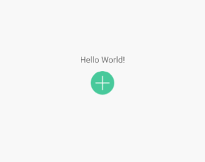

分享一些自己做的小控件

这算分享的第二个控件吧，效果见下图

 

```kotlin
fun demo() {
    open_button.setNum(0) //设置默认数字
                .setTextSizeDp(30f) //设置字体大小
                .setAddImageRes(R.drawable.cart_add) //设置加号图标
                .setSubImageRes(R.drawable.cart_sub) //设置减号图标
                
    open_button.getNum() //获取数量
}
```
